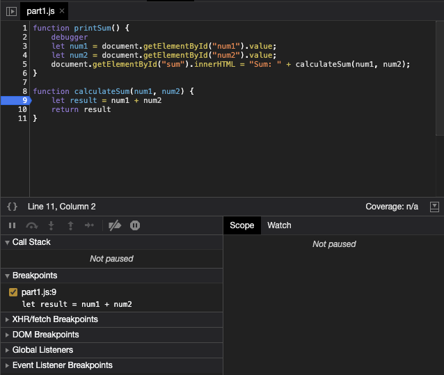
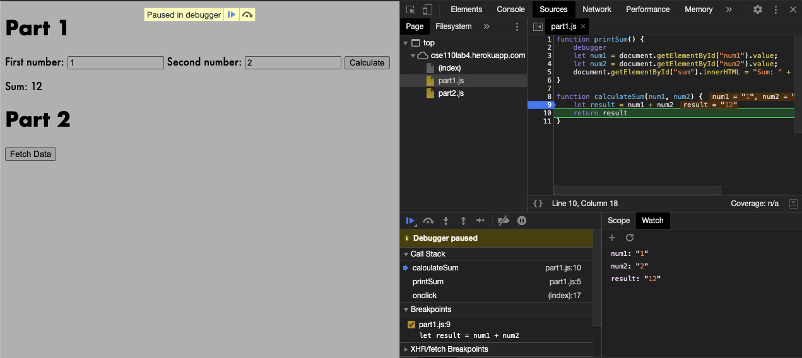
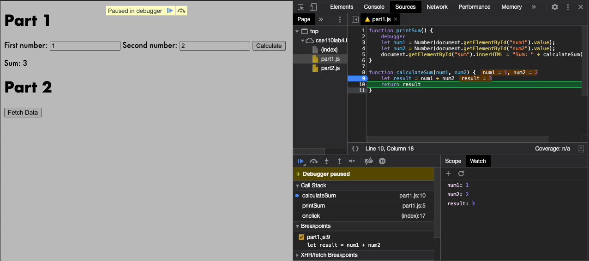

# Part 3: Debugging

## Breakpoint

## Watch List

## The Fix

The issue was that the code adding string addition which isn't the same as integer addition. The fix I made was to type cast the values, `num1` and `num2` to integers using the `Number()` function.

## Part 2

1. citylots.json
2. part2.js
3. 11.7 mb
4. 1.84 seconds
5. Mozilla/5.0 (Macintosh; Intel Mac OS X 11_1_0) AppleWebKit/537.36 (KHTML, like Gecko) Chrome/87.0.4280.141 Safari/537.36
6. Tue, 26 Jan 2021 22:14:13 GMT
7. application/json
8. fetchData
